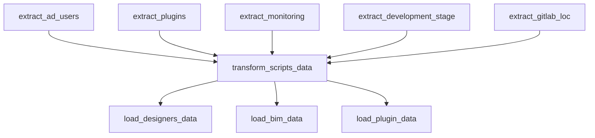
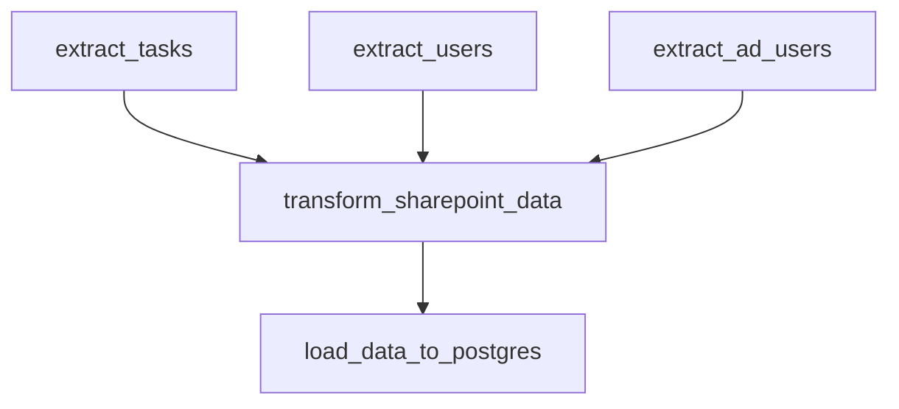

# Архитектура Airflow ETL Pipeline

**Версия:** 1.1
**Дата:** 2025-10-23

---

## Содержание

1. [Обзор архитектуры](#обзор-архитектуры)
2. [Потоки данных](#потоки-данных)
3. [Модульная структура](#модульная-структура)
4. [Зависимости между DAG](#зависимости-между-dag)
5. [Стратегии загрузки данных](#стратегии-загрузки-данных)
6. [Безопасность и аутентификация](#безопасность-и-аутентификация)

---

## Обзор архитектуры

### Высокоуровневая схема

```
┌─────────────────────────────────────────────────────────────────┐
│                    Источники данных                              │
├──────────────┬──────────────┬──────────────┬────────────────────┤
│ PostgreSQL   │   GitLab     │  SharePoint  │  Google Sheets     │
│ (pluginsdb)  │   API        │   REST API   │     API            │
└──────┬───────┴──────┬───────┴──────┬───────┴────────┬───────────┘
       │              │              │                │
       ▼              ▼              ▼                ▼
┌────────────────────────────────────────────────────────────────┐
│                   Airflow DAGs (6 шт)                          │
├────────────────────────────────────────────────────────────────┤
│  scripts_etl_dag (daily 6:00)    - Основной комплексный        │
│  gitlab_etl_dag (weekly Sun)     - GitLab LOC аналитика        │
│  projectsync_etl_dag (daily 3:00)- Синхронизация проектов      │
│  logs_etl_dag (daily 2:00)       - Аналитика логов             │
│  sharepoint_etl_dag (*/15 min)   - SharePoint задачи           │
│  gsheet_families_etl_dag (*/2h)  - Google Sheets семейства     │
└────────────┬───────────────────────────────────────────────────┘
             │
             ▼
┌────────────────────────────────────────────────────────────────┐
│                 ETL Modules (Extract/Transform/Load)            │
├────────────────────────────────────────────────────────────────┤
│  etl_pipelines/          - Общие ETL модули                    │
│  coord_sharepoint_etl/   - SharePoint/GSheet модули            │
│  config.py               - Централизованная конфигурация       │
│  utils.py                - Общие утилиты                       │
└────────────┬───────────────────────────────────────────────────┘
             │
             ▼
┌────────────────────────────────────────────────────────────────┐
│              PostgreSQL Datalake (9 таблиц)                    │
├────────────────────────────────────────────────────────────────┤
│  datalake.ext_scripts_analytics_designers                      │
│  datalake.ext_scripts_analytics_bim                            │
│  datalake.ext_scripts_plugin                                   │
│  datalake.ext_scripts_gitlab                                   │
│  datalake.ext_project_sync_designers                           │
│  datalake.ext_project_sync_bim                                 │
│  datalake.ext_logs_analytics_designers                         │
│  datalake.ext_logs_analytics_bim                               │
│  datalake.ext_sharepoint_coord                                 │
└────────────────────────────────────────────────────────────────┘
```

---

## Потоки данных

### 1. Scripts ETL DAG (Основной)

**Schedule:** Ежедневно в 6:00 UTC

```
[PostgreSQL pluginsdb]          [GitLab API]
       │                              │
       ├─ users.ad_user               └─ Projects + LOC
       ├─ plugins.plugin
       ├─ plugins.monitoring
       └─ plugins.plugin_development_stage
       │
       ▼
┌─────────────────────────────────────────┐
│         Extract (параллельно)            │
│  - extract_ad_users()                   │
│  - extract_plugins()                    │
│  - extract_monitoring()                 │
│  - extract_development_stage()          │
│  - extract_gitlab_loc()                 │
└─────────────┬───────────────────────────┘
              ▼
┌─────────────────────────────────────────┐
│           Transform                      │
│  - Merge monitoring + plugins            │
│  - Классификация BIM/designers          │
│  - Заполнение пропусков                  │
│  - Создание short_project_name           │
└─────────────┬───────────────────────────┘
              ▼
┌─────────────────────────────────────────┐
│        Load (параллельно)                │
│  → ext_scripts_analytics_designers       │
│  → ext_scripts_analytics_bim             │
│  → ext_scripts_plugin                    │
└──────────────────────────────────────────┘
```

**Ключевые моменты:**
- 5 источников данных
- Параллельная экстракция
- 3 целевые таблицы
- Стратегия: REPLACE

### 2. GitLab ETL DAG

**Schedule:** Еженедельно в воскресенье 5:00 UTC

```
[GitLab API] → [Extract LOC] → [Transform] → [Load]
                      │              │           │
                   Clone repos   Rename cols   REPLACE
                   Count LOC     JSON→CSV      ext_scripts_gitlab
                   (parallel)
```

**Ключевые моменты:**
- ThreadPoolExecutor (8 workers)
- Клонирование Git репозиториев
- Подсчет LOC по языкам: C#, Python, XAML, JS, TS, CSS, HTML, YAML
- Стратегия: REPLACE

### 3. ProjectSync ETL DAG

**Schedule:** Ежедневно в 3:00 UTC

```
[PostgreSQL pluginsdb]
       │
       ├─ users.ad_user
       └─ projects.project_sync
       │
       ▼
[Extract] → [Transform] → [Load (incremental)]
              │               │
            Classify       Delete today
            BIM/designers  + Insert new
            Determine      → ext_project_sync_*
            solution/stage
```

**Ключевые моменты:**
- Инкрементальная загрузка (по дате)
- Определение объекта (Кортрос, АТОМ, ИНПРО, Ялта)
- Определение раздела (АР, КР, ВК и т.д.)
- Определение стадии (П, Р, ЭП)
- Стратегия: INCREMENTAL (по sync_date)

### 4. Logs ETL DAG

**Schedule:** Ежедневно в 2:00 UTC

```
[PostgreSQL pluginsdb]
       │
       ├─ plugins.log
       └─ plugins.plugin
       │
       ▼
[Extract] → [Transform] → [Load]
              │               │
            Merge          REPLACE
            Classify       → ext_logs_analytics_*
            BIM/designers
```

**Ключевые моменты:**
- Merge logs + plugins (display_name, developer)
- Классификация по BIM_USERS
- Удаление ненужных столбцов
- Стратегия: REPLACE

### 5. SharePoint ETL DAG

**Schedule:** Каждые 15 минут

```
[SharePoint REST] [PostgreSQL]
       │                │
       ├─ Tasks         └─ users.ad_user
       └─ Users
       │
       ▼
[Extract] → [Transform] → [Load (UPSERT)]
              │               │
            Parse HTML    UPSERT by guid
            Workdays calc → ext_sharepoint_coord
            Mappings
```

**Ключевые моменты:**
- NTLM аутентификация
- Расчет рабочих дней (workalendar Russia)
- Парсинг HTML описаний
- Маппинг типов запросов и дисциплин
- Стратегия: UPSERT (by guid)

### 6. Google Sheets Families ETL DAG

**Schedule:** Каждые 2 часа

```
[Google Sheets API]
       │
       └─ DB_Семейства
       │
       ▼
[Extract] → [Transform] → [Load (UPSERT)]
              │               │
            Generate guid UPSERT by guid
            Map discipline → ext_sharepoint_coord
            Set defaults
```

**Ключевые моменты:**
- Service Account аутентификация
- Детерминированный GUID (UUID v5)
- Merge с SharePoint таблицей
- Стратегия: UPSERT (by guid)

---

## Модульная структура

### Extract Layer

**Принципы:**
- Один модуль на один источник данных
- Возврат пути к CSV/JSON файлу
- Минимальная трансформация (только извлечение)

**Модули:**
```
etl_pipelines/extract/
├── pluginsdb.py         - PostgreSQL extractors (6 функций)
│   ├── extract_ad_users()
│   ├── extract_plugins()
│   ├── extract_monitoring()
│   ├── extract_development_stage()
│   ├── extract_project_sync()
│   └── extract_logs()
└── gitlab.py            - GitLab LOC extraction
    └── extract_gitlab_lines()

coord_sharepoint_etl/extract/
├── sharepoint.py        - SharePoint REST API
│   ├── extract_tasks()
│   └── extract_users()
├── gsheet.py            - Google Sheets API
│   └── extract_families_as_dataframe()
└── tim_db.py            - PostgreSQL AD users (DEPRECATED - см. pluginsdb.py)
    └── extract_ad_users()
```

### Transform Layer

**Принципы:**
- Бизнес-логика трансформации
- Классификация BIM/designers
- Маппинг значений
- Заполнение пропусков
- Возврат DataFrame или tuple[DataFrame]

**Модули:**
```
etl_pipelines/transform/
├── scripts.py           - Scripts analytics
│   └── transform_scripts_analytics() → (df_designers, df_bim, df_plugin)
├── gitlab.py            - GitLab analytics
│   └── transform_gitlab_analytics() → df
├── projectsync.py       - Project sync analytics
│   └── transform_projectsync_analytics() → (df_designers, df_bim)
└── logs.py              - Logs analytics
    └── transform_logs_analytics() → (df_designers, df_bim)

coord_sharepoint_etl/transform/
├── sharepoint.py        - SharePoint трансформации
│   └── transform_sharepoint_data() → str (path)
└── gsheet.py            - GSheet трансформации
    └── transform_gsheet_data_df() → df
```

### Load Layer

**Принципы:**
- Универсальная загрузка в PostgreSQL
- Поддержка разных стратегий (REPLACE, INCREMENTAL, UPSERT)
- Автоматическое создание таблиц
- COPY EXPERT для производительности

**Модули:**
```
etl_pipelines/load/
└── datalake.py
    ├── load_to_postgres()            - REPLACE стратегия
    └── load_incremental_to_postgres() - INCREMENTAL стратегия

coord_sharepoint_etl/load/
└── sharepoint.py
    └── load_data_to_postgres()        - UPSERT стратегия
```

### Config & Utils

**Новые модули (v1.1):**

```
dags/config.py           - Централизованная конфигурация
├── BIM_USERS            - 18 человек
├── FORBIDDEN_USERS      - 6 фамилий
├── TO_REMOVE            - 2 фамилии
├── DISCIPLINE_MAPPING   - 21 маппинг
├── TYPE_REQUEST_MAPPING - 14 маппингов
├── SECTION_MAP_*        - Разделы проектов
└── STAGE_MAP_*          - Стадии проектов

dags/utils.py            - Общие утилиты
├── extract_short_name()       - Извлечение короткого имени
├── extract_file_storage_name()- Название хранилища
├── check_responsible()        - Фильтр пользователей
├── remove_specific()          - Удаление пользователей
├── clean_html_safe()          - Парсинг HTML
├── extract_number()           - Извлечение номера заявки
├── clean_type_request()       - Очистка типа запроса
├── to_local()                 - Конвертация в локальное время
├── workdays_diff()            - Подсчет рабочих дней
├── parse_responsible_ids()    - Парсинг ID SharePoint
├── get_project_solution()     - Определение раздела
└── get_project_stage()        - Определение стадии
```

---

## Зависимости между DAG

### Временные зависимости (по schedule)

```
02:00 UTC → logs_etl_dag           (ежедневно)
03:00 UTC → projectsync_etl_dag    (ежедневно)
05:00 UTC → gitlab_etl_dag         (еженедельно, воскресенье)
06:00 UTC → scripts_etl_dag        (ежедневно) ⭐ ОСНОВНОЙ

*/2 hours → gsheet_families_etl_dag (каждые 2 часа)
*/15 min  → sharepoint_etl_dag     (каждые 15 минут)
```

### Логические зависимости

**Нет прямых зависимостей между DAG** - каждый DAG независим.

Однако есть общие зависимости от источников:
```
pluginsdb (PostgreSQL)
    ├── scripts_etl_dag
    ├── gitlab_etl_dag
    ├── projectsync_etl_dag
    ├── logs_etl_dag
    └── sharepoint_etl_dag

GitLab API
    ├── scripts_etl_dag
    └── gitlab_etl_dag

SharePoint REST API
    └── sharepoint_etl_dag

Google Sheets API
    └── gsheet_families_etl_dag
```

### Зависимости внутри DAG

**Пример: scripts_etl_dag**
```
extract_ad_users()  ┐
extract_plugins()   ├─→ transform_scripts_data() ┬→ load_designers_data()
extract_monitoring()│                              ├→ load_bim_data()
extract_dev_stage() │                              └→ load_plugin_data()
extract_gitlab_loc()┘
```

**Характеристики:**
- Extract задачи выполняются параллельно
- Transform ждет завершения всех Extract
- Load задачи выполняются параллельно после Transform

---

## Стратегии загрузки данных

### 1. REPLACE (Полная перезапись)

**Используется в:**
- scripts_etl_dag → все 3 таблицы
- gitlab_etl_dag → ext_scripts_gitlab
- logs_etl_dag → обе таблицы

**Алгоритм:**
```python
1. DROP TABLE IF EXISTS target_table
2. CREATE TABLE target_table (auto-schema from DataFrame)
3. COPY data FROM CSV (COPY EXPERT)
```

**Преимущества:**
- Простота
- Всегда актуальные данные
- Нет конфликтов

**Недостатки:**
- Потеря истории
- Высокая нагрузка на БД

### 2. INCREMENTAL (Инкрементальная)

**Используется в:**
- projectsync_etl_dag → обе таблицы

**Алгоритм:**
```python
1. Определить date_column (sync_date)
2. DELETE FROM target_table WHERE sync_date IN (SELECT DISTINCT sync_date FROM new_data)
3. INSERT INTO target_table SELECT * FROM new_data
```

**Преимущества:**
- Сохранение истории
- Меньшая нагрузка на БД
- Можно перезагружать только конкретные даты

**Недостатки:**
- Сложнее логика
- Нужна уникальная дата

### 3. UPSERT (Insert or Update)

**Используется в:**
- sharepoint_etl_dag → ext_sharepoint_coord
- gsheet_families_etl_dag → ext_sharepoint_coord

**Алгоритм:**
```python
1. CREATE TEMP TABLE stg_ext_sharepoint_coord
2. COPY data TO staging table
3. INSERT INTO target_table ... ON CONFLICT (guid) DO UPDATE SET ...
4. DROP staging table
```

**Преимущества:**
- Идемпотентность
- Обновление существующих записей
- Работа с частыми обновлениями (каждые 15 мин)

**Недостатки:**
- Требует PRIMARY KEY
- Сложнее реализация

---

## Безопасность и аутентификация

### Airflow Connections (4 шт)

```
1. tim_db_pluginsdb
   Type: postgres
   Host: 192.168.42.188
   Port: 5430
   Database: pluginsdb
   Schema: [users, plugins, projects, log]

2. tim_db_postgres
   Type: postgres
   Host: 192.168.42.188
   Port: 5430
   Database: postgres
   Schema: datalake

3. gitlab_api
   Type: http
   Host: http://192.168.42.188:13080
   Password: <GITLAB_TOKEN>

4. askit_http_sharepoint_tim
   Type: http
   Host: <SHAREPOINT_URL>
   Login: <DOMAIN\USERNAME>
   Password: <PASSWORD>
   Extra: {"auth_type": "ntlm"}
```

### Airflow Variables (5 шт)

```
1. ETL_DATA_ROOT_PATH (string)
   Путь: /tmp/data или C:\temp\data
   Используется: все DAG для временных файлов

2. gsheet_config (json)
   Для: gitlab_etl_dag (НЕ ИСПОЛЬЗУЕТСЯ в v1.1)
   Содержит: spreadsheet_key, worksheet_name

3. gsheet_families_key (string)
   Для: gsheet_families_etl_dag
   Значение: ID Google Spreadsheet

4. gsheet_families_worksheet (string)
   Для: gsheet_families_etl_dag
   Значение: "DB_Семейства"

5. gsheet_service_account_json (json)
   Для: gsheet_families_etl_dag, sharepoint_etl_dag
   Содержит: полный JSON service account
```

### Секреты и токены

**Файл:** `config/tokens.json`
```json
{
  "gitlab": {
    "token": "STORED_IN_AIRFLOW_CONNECTION",
    "url": "http://192.168.42.188:13080"
  },
  "google_sheets": {
    "service_account": "config/revitmaterials-db15db824f22.json",
    "scopes": ["https://www.googleapis.com/auth/spreadsheets"]
  },
  "sharepoint": {
    "auth_type": "ntlm",
    "credentials": "STORED_IN_AIRFLOW_CONNECTION"
  }
}
```

**Google Service Account:**
- Файл: `config/revitmaterials-db15db824f22.json`
- Доступ: Read-only к определенным spreadsheets
- Scopes: spreadsheets (readonly)

---

## Производительность и оптимизация

### Параллелизация

**1. На уровне задач (Task-level)**
```python
# scripts_etl_dag
extract_tasks = [
    extract_ad_users(),
    extract_plugins(),
    extract_monitoring(),
    extract_development_stage(),
    extract_gitlab_loc()
]
# Все задачи запускаются параллельно
```

**2. На уровне воркеров (Thread-level)**
```python
# gitlab.py: extract_gitlab_lines
with ThreadPoolExecutor(max_workers=8) as executor:
    futures = [executor.submit(process_project, p) for p in projects]
```

### Временные файлы

**Структура:**
```
$ETL_DATA_ROOT_PATH/
├── scripts/
│   ├── tim_export_ad_user.csv
│   ├── tim_export_plugin.csv
│   ├── tim_export_monitoring.csv
│   ├── tim_export_plugin_development_stage.csv
│   ├── gitlab_export_lines.json
│   ├── scripts_designers_transformed.csv
│   ├── scripts_bim_transformed.csv
│   └── scripts_plugin_transformed.csv
├── gitlab/
├── projectsync/
├── logs/
├── sharepoint/
└── gsheet_families/
```

### COPY EXPERT для загрузки

**Вместо INSERT:**
```python
# Медленно
df.to_sql(table_name, engine, if_exists='append')

# Быстро (используется в проекте)
cursor.copy_expert(f"COPY {schema}.{table_name} FROM STDIN WITH CSV HEADER", buffer)
```

**Прирост производительности:** 5-10x

---

## Мониторинг и логирование

### Airflow UI

```
http://localhost:8080

Разделы:
- DAGs: список и статус всех DAG
- Runs: история запусков
- Task Duration: графики длительности задач
- Gantt: диаграмма Ганта выполнения
- Task Instances: детали каждой задачи
```

### Логи

**Структура:**
```
$AIRFLOW_HOME/logs/
├── scheduler/
│   └── latest/
└── dag_id/
    └── task_id/
        └── execution_date/
            └── attempt.log
```

**Просмотр логов:**
```bash
# Через UI
http://localhost:8080 → DAGs → Task → View Log

# Через CLI
airflow tasks logs <dag_id> <task_id> <execution_date>

# Напрямую
tail -f $AIRFLOW_HOME/logs/scripts_etl_dag/extract_ad_users/2024-01-01/1.log
```

### Метрики

**Встроенные:**
- Task Duration
- Task Success Rate
- DAG Run Duration
- Task Failures
- SLA Misses

---

## Диаграммы зависимостей

### scripts_etl_dag



### sharepoint_etl_dag



---

**Дата последнего обновления:** 2025-10-23
**Версия архитектуры:** 1.1
